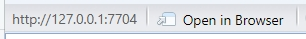
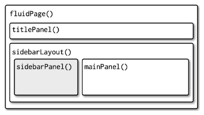

```{r setup, include=FALSE}
knitr::opts_chunk$set(eval = FALSE,echo = TRUE)
```

# Introduction

A Shiny app in R is a web application framework that allows users to create interactive and dynamic web apps directly from R without needing extensive web development skills. Shiny combines the power of R’s data analysis and visualization capabilities with an easy-to-use interface for building responsive, interactive applications.

Key important of every Shiny app: 
  1. UI (short for user interface) which defines how your app looks
  2. server function: defines how your app works 
  3. reactive programming:automatically update outputs when inputs change  

# 1. Install and load Shiny package


```{r}
getwd()
```


```{r}
if (!require('shiny')) install.packages('shiny')
library(shiny)
```
# 2. Create a sample shiny app

Create a new directory and an app.R file containing a basic app in one step by clicking File | New Project | Shiny Web Application. 

There are a few ways you can run this app:

- Click the Run App button in the document toolbar
- Use a keyboard shorcut: Cmd/Ctrl + Shift + Enter

## 2.1 URL of your shiny app

127.0.0.1 is a standard address that means “this computer” and 7704 is a randomly assigned port number. 




# 3. Web page structure



## 3.1 Basic UI in sidebarPanel()

### 3.1.1 Create file

Create a file called *app.R* in your file directory. The *app.R* file is used to show how your app should look, and how it should behave. 


### 3.1.2 Read Housing Mortgage data

```{r}
library(shiny);library(leaflet);library(sf);library(dplyr)

points_data <- st_read("cbsa_points.shp") 

tf_data = st_transform(points_data, crs = '+proj=longlat +datum=WGS84')
```


### 3.1.3 Set up the basic structore of the webpage

Layout functions define the overall visual structure of a Shiny app. They are built through a hierarchy of function calls, with the structure in R mirroring the structure of the resulting HTML.

```{r}
fluidPage(
  titlePanel('Housing Mortgage'),
  sidebarLayout(
    sidebarPanel(),
    mainPanel()
  )
)
```

### 3.1.4 Common sturcture for input controls

The common structure for the input controls are two arguments:

- All input functions in Shiny share the same first argument: inputId. This identifier links the user interface (UI) to the server. For example, if you have an input in your UI with inputId = "name", the server will reference it as input$name.

  - There are two important rules for inputId:

1. It must be a simple string that only includes letters, numbers, and underscores (avoid spaces, dashes, periods, or any special characters). Think of it like naming a variable in R.

2. It must be unique. If two inputs have the same inputId, the server won't be able to distinguish between them.

- Most input functions also have a second argument called label. This creates a user-friendly label for the input. While there are no restrictions on what the label can be, it's important to choose one that makes your app easy to understand for users.

### 3.1.5 Limited choices: sliderInput

[sliderInput-Shiny](https://shiny.posit.co/r/reference/shiny/0.14/sliderinput)

```{r}
sliderInput(inputId = "mortgageRange",
                  label = "Mortgage Range:",
                  min = 0,
                  max = max(tf_data$Mortgage, na.rm = TRUE),
                  value = c(0, max(tf_data$Mortgage, na.rm = TRUE)))
```

### 3.1.6 Limited choices: selectInput

[selectInput](https://shiny.posit.co/r/reference/shiny/1.2.0/selectinput)

```{r}
selectInput(inputId = "stateFilter", 
            label = "Select State:",
            choices = unique(tf_data$State), 
            selected = unique(tf_data$State)[1], 
            multiple = TRUE)

```
### 3.1.7 mainpanel: LeafletOutput

[LeafletOutput](https://www.rdocumentation.org/packages/leaflet/versions/2.2.2/topics/leafletOutput)

```{r}
leafletOutput(outputId = "map", width = '100%', height = '1500px')
```

## 3.2 Basic Reactivity

In reactive programming, the main idea is to create a network of connections between inputs and outputs. When an input changes, all related outputs are updated automatically. This makes the app's behavior easier to manage, but it can take some time to fully understand how everything works together

### 3.2.1 The server function

Server functions take three parameters: `input`, `output`.

```{r}
server = function(input, output){
  
}
```

### 3.2.2 Input

The input argument is a list-like object that contains all the input data sent from the browser, named according to the input ID. 

One important thing to know about input is that it can only be accessed in specific situations. To read the value of an input, you need to be inside a reactive function, like `renderText()` or [`reactive()`](https://www.rdocumentation.org/packages/shiny/versions/1.9.1/topics/reactive). These functions make sure the app reacts to changes in the input.

reactive: Create a reactive expression

In Shiny, a reactive expression is a special type of function that automatically updates its value when the inputs it depends on change. It helps manage dynamic behavior in Shiny apps.


```{r}
  filtered_data <- reactive({
    tf_data %>%
      filter(Mortgage >= input$mortgageRange[1],
             Mortgage <= input$mortgageRange[2],
             State %in% input$stateFilter)
  })
```


### 3.2.3 Output: 

The output object works similarly to input: it's a list-like object where each item is named according to the outputId. The difference is that output is used to display information (like text, tables, or plots) rather than receive input. You always use the output object along with a render* function to create the output.

[Example of render* function](https://shiny.posit.co/r/getstarted/build-an-app/reactive-flow/render-functions.html)

```{r}
# Render the leaflet map
  output$map <- renderLeaflet({
    leaflet(height = 500) %>%
      addTiles() %>%
      setView(lng = mean(st_coordinates(tf_data)[,1]), 
              lat = mean(st_coordinates(tf_data)[,2]), 
              zoom = 6)
  })
```

## 3.3 Reactive function: observe ({})

A reactive function in Shiny that watches for changes in any reactive input or data (e.g., filtered_data() in this case). When the observed data changes, the code inside observe() is executed automatically. It is used to create dynamic behaviors in a Shiny app.

### 3.3.1 leafletProxy()

leafletProxy() is used to modify an existing Leaflet map without redrawing it from scratch.
The first argument is the ID of the map ("map"), and the second argument is the data (filtered_data()). The filtered data will be used to update the markers on the map.

```{r}
 observe({
    leafletProxy("map", data = filtered_data()) %>%
      clearMarkers() %>%
      addCircleMarkers(
        radius = 3,  # Adjust size based on Mortgage value (adjust the divisor as needed)
        color = "blue",
        stroke = FALSE,
        fillOpacity = 0.5,
        label = ~paste("Mortgage:", Mortgage, "<br>", "State:", State)
      )
  })
```

# 4. Running app

Click the *Run App* button in the document toolbar. 'Select Run external' to display the app in external browser. 

## 4.1 Share your app as a web page - Shinyapps.io

Follow the steps (From Step 5) in below to publish your shiny app

https://statsandr.com/blog/how-to-publish-shiny-app-example-with-shinyapps-io/

Shinyapps.io has limitation to the number of app and hour of app view

## 4.2 Share app on github

[Github source](https://github.com/RamiKrispin/shinylive-r)

- First, install the shinylive and httpuv packages from CRAN
```{r}
install.packages(c("shinylive", "httpuv"))
```

```{r}

```


- Export the app into HTML file

The 'appdir' argument specifies the folder containing the Shiny app. The destdir argument defines where the rendered site will be saved (in this case, the output directory is set to docs)

```{r}
path = "the folder that contain app.R"

shinylive::export(appdir = path, destdir = "docs")
```

- Create a new repo in you github

- clone the repo to your device

- Copy the whole 'docs' folder to local repo

- Generate the web page


